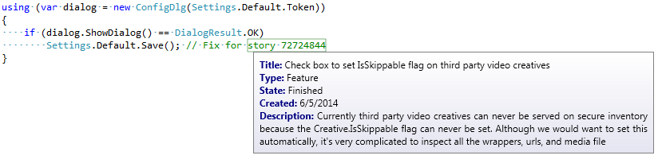

This C# .NET4 project outputs PivotalTrackerPlugin.slp which is a plugin for
SourceLinks by Whole Tomato Software: http://www.wholetomato.com/sourcelinks

SourceLinks is a Visual Studio plugin that can be installed using the Tools/Extensions
menu. This project is, in turn, a plugin for the SourceLinks plugin, and allows SourceLinks
to work with live data pulled from PivotalTracker: http://www.pivotaltracker.com

Copy PivotalTrackerPlugin.slp into the same folder as SourceLinks.dll, reload Visual
Studio, and configure it under the SourceLinks tab on the Tools/Options dialog.

